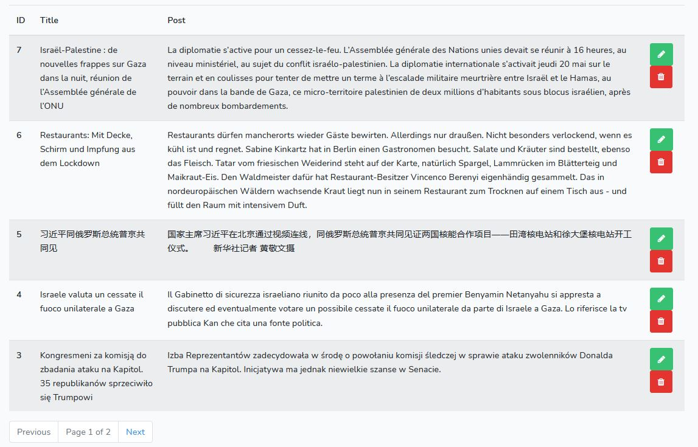

#### 1. Clone the repo and cd into it
#### 2.  composer install
#### 3.   Rename or copy .env.example file to .env
#### 4.  php artisan key:generate
#### 5.   Set your database credentials in your .env file
#### 6. php artisan migrate
#### 7. npm install & npm run dev
#### 8.  php artisan serve or use Laravel Valet or Laravel Homestead
#### 9.  Visit localhost:8000 in your browser

